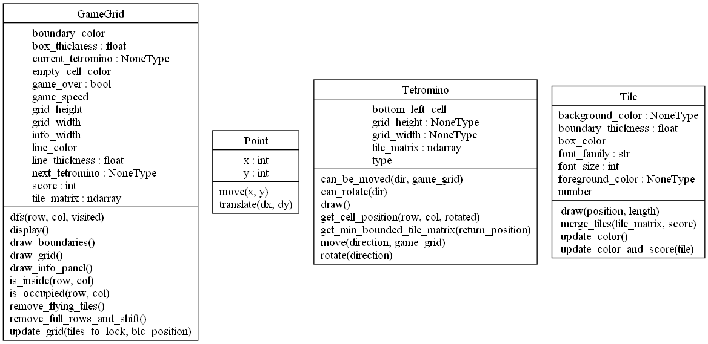
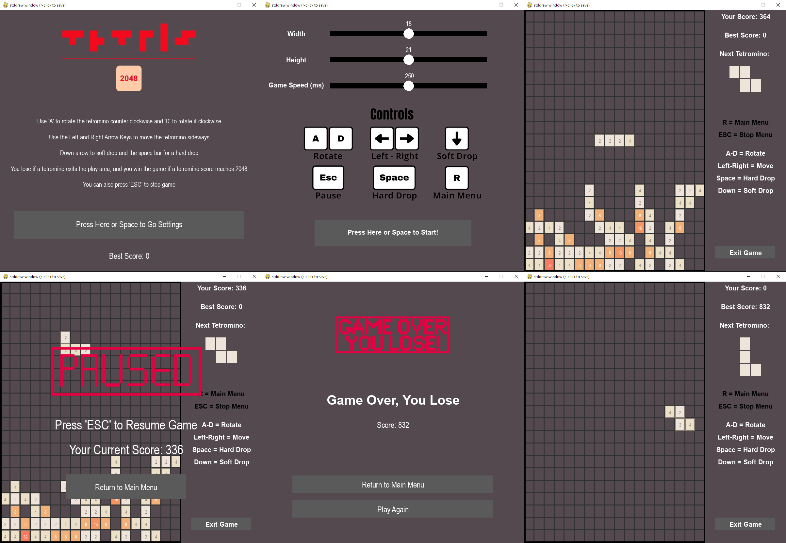

# Tetris 2048 Game

This project combines the classic games Tetris and 2048 into a single game named Tetris 2048. Developed in Python, this
game utilizes the StdDraw library to provide a smooth and user-friendly gaming experience. The goal is to deliver an
engaging and enjoyable gameplay that appeals to both Tetris and 2048 enthusiasts.

## Step by Step Installation

This project developed with

```
Pyton 3.12.0
```

Clone repository with following command in your terminal:

```bash
git clone $repository_link
```

Create environment to run code

```bash
python3 -m venv venv
```

Use the package manager [pip](https://pip.pypa.io/en/stable/) to run requirements file.

```bash
pip install -r requirements.txt
```

Ensure that your code editor or IDE is set to use the Python interpreter from the virtual environment. This setting is
usually found in the preferences or settings menu under "Python Interpreter" or similar. Choose the interpreter located
inside your virtual environment directory.

## Usage

After you go to directory of the source code, you can use the following command to play game:

```bash
python3 Tetris_2048.py
```

## Features

You can find the instructions for playing the game in the menu. You can customize the game grid and set the game speed
to your preference. Throughout the game, you can control and rotate the tetrominoes using the specified keys. All Tetris
and 2048 rules have been combined! You can pause, restart, and resume the game at any time. Have fun!

## UML Diagram of the Game



## Screenshots

You can see the screenshots from the game:




